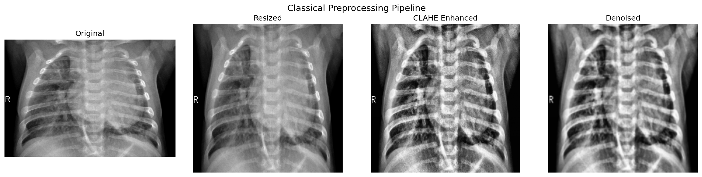
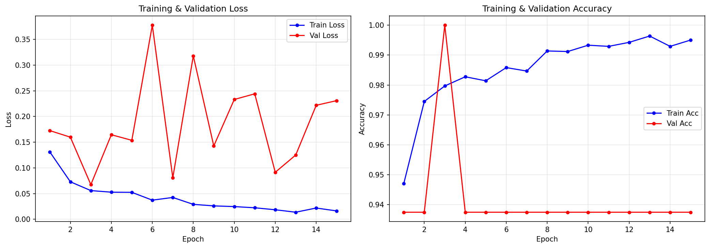
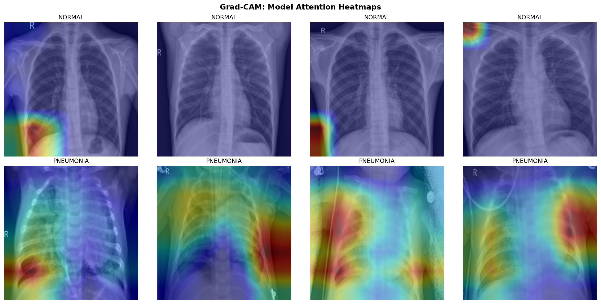

# Chest X-Ray Pneumonia Detection

This repository compares two approaches for binary chest X-ray classification:

- A classical machine learning pipeline based on handcrafted image features
- A deep learning pipeline based on transfer learning with ResNet18

The goal is to classify chest X-ray images into `NORMAL` and `PNEUMONIA`, generate evaluation plots, and save trained artifacts for later analysis.

This project is best understood as a research or educational workflow rather than a production medical system. It should not be used for clinical decision-making.

## What Is Included

- End-to-end classical ML training and evaluation
- End-to-end deep learning training and evaluation
- Preprocessing and feature engineering for grayscale X-ray images
- Performance reporting with accuracy, sensitivity, specificity, F1-score, and AUC-ROC
- Confusion matrices and ROC curves
- Training history plots for the neural network
- Grad-CAM heatmaps for model interpretability
- Saved model artifacts under `results/`

## Repository Structure

```text
chest_xray/
|-- classical_pipeline.py
|-- deep_learning_pipeline.py
|-- main.py
|-- README.md
|-- LICENSE
`-- results/
    |-- classical/
    |   |-- best_model.pkl
    |   |-- classical_metrics_comparison.png
    |   |-- classical_results.png
    |   `-- preprocessing_pipeline.png
    `-- deep_learning/
        |-- best_model.pth
        |-- dl_evaluation_results.png
        |-- gradcam_heatmaps.png
        `-- training_history.png
```

Additional historical artifacts may also be present in `results/classical/` from earlier runs.

## Problem Setup

- Task: binary image classification
- Classes:
  - `NORMAL`
  - `PNEUMONIA`
- Input data: chest X-ray images organized into train/validation/test folders

The current code expects the common folder layout below:

```text
chest_xray/
|-- train/
|   |-- NORMAL/
|   `-- PNEUMONIA/
|-- val/
|   |-- NORMAL/
|   `-- PNEUMONIA/
`-- test/
    |-- NORMAL/
    `-- PNEUMONIA/
```

## Pipeline Overview

### 1. Classical Machine Learning Pipeline

Implemented in `classical_pipeline.py`.

Main stages:

1. Preprocess each image
2. Extract handcrafted and pixel-based features
3. Standardize features and reduce dimensionality with PCA
4. Train multiple classifiers
5. Optimize the decision threshold
6. Evaluate and save visualizations

Preprocessing steps:

- Convert to grayscale with OpenCV
- Resize to `256 x 256`
- Apply CLAHE for local contrast enhancement
- Apply Gaussian blur for denoising

Feature extraction includes:

- GLCM texture features
- Intensity histogram features and statistical moments
- LBP texture features
- HOG descriptors
- Spatial edge and regional statistics
- Flattened pixel features from `128 x 128` images

Modeling steps:

- Standardization with `StandardScaler`
- Dimensionality reduction with `PCA(n_components=300)`
- Candidate models:
  - `SVM (RBF)`
  - `RandomForest`
  - `Ensemble (SVM + RF + GradientBoosting)` using soft voting

Threshold strategy:

- The pipeline uses cross-validation on the training set to find a probability threshold that maximizes the geometric mean of sensitivity and specificity.
- If the selected threshold does not satisfy the target operating floor on the test set, the code may search again on the test probabilities.

Outputs written by the current script:

- `results/classical/best_model.pkl`
- `results/classical/classical_results.png`
- `results/classical/classical_metrics_comparison.png`
- `results/classical/preprocessing_pipeline.png`

### 2. Deep Learning Pipeline

Implemented in `deep_learning_pipeline.py`.

Main stages:

1. Build datasets and dataloaders
2. Apply augmentation and normalization
3. Fine-tune a pretrained ResNet18
4. Optimize the classification threshold
5. Evaluate on the test set
6. Generate Grad-CAM visualizations

Data pipeline details:

- Images are resized to `224 x 224`
- Training augmentation includes:
  - horizontal flip
  - small rotations
  - small affine translations
  - brightness and contrast jitter
- Test and validation images are normalized with ImageNet statistics
- A `WeightedRandomSampler` is used to reduce class imbalance during training

Model details:

- Backbone: `ResNet18` pretrained on ImageNet
- Frozen layers: all layers except `layer4` and `fc`
- Final classifier:
  - `Dropout(0.3)`
  - `Linear(num_features, 1)`

Training details:

- Loss: `BCEWithLogitsLoss`
- Optimizer: `Adam`
- Scheduler: `ReduceLROnPlateau`
- Default epochs: `15`
- Batch size: `32`
- Learning rate: `1e-4`
- Device: CUDA if available, otherwise CPU

Interpretability:

- Grad-CAM heatmaps are generated from the last block of `layer4`
- The output helps visualize where the model attends in X-ray images

Outputs written by the current script:

- `results/deep_learning/best_model.pth`
- `results/deep_learning/training_history.png`
- `results/deep_learning/dl_evaluation_results.png`
- `results/deep_learning/gradcam_heatmaps.png`

### 3. Combined Runner

`main.py` is intended to:

- run the classical pipeline
- run the deep learning pipeline
- compare the best classical model against the deep learning model
- save a final `comparison_chart.png` under `results/`

Important note:

- The checked-in `main.py` currently does not compile because of an indentation problem in `main()`.
- That means the combined runner is not usable as-is until that syntax issue is fixed.
- The two individual pipeline scripts can still be run directly.

## Evaluation Metrics

Both pipelines report:

- Accuracy
- Sensitivity
- Specificity
- F1-score
- AUC-ROC
- Confusion matrix
- Total inference time
- Approximate per-image latency

Target thresholds used by the code:

- Classical pipeline comparison floor: `0.80`
- Deep learning comparison floor: `0.90`

## Installation

This repository does not currently include a `requirements.txt`, so dependencies need to be installed manually.

Suggested environment:

- Python 3.10+
- Windows environment matches the current hardcoded paths, although the code can be adapted for other systems

Create a virtual environment and install the main dependencies:

```powershell
py -m venv .venv
.venv\Scripts\Activate.ps1
python -m pip install --upgrade pip
pip install numpy matplotlib opencv-python scikit-image scikit-learn seaborn pillow torch torchvision
```

## Configuration

Before running the project, review the hardcoded paths in the source files.

Current defaults in the code:

- `classical_pipeline.py`
  - `DATA_DIR = c:\Users\baris\Downloads\chest_xray`
  - `OUTPUT_DIR = c:\Users\baris\Documents\Projects\chest_xray\results\classical`
- `deep_learning_pipeline.py`
  - `DATA_DIR = c:\Users\baris\Downloads\chest_xray`
  - `OUTPUT_DIR = c:\Users\baris\Documents\Projects\chest_xray\results\deep_learning`
- `main.py`
  - `RESULTS_DIR = c:\Users\baris\Documents\Projects\chest_xray\results`

If your dataset or project folder lives somewhere else, update these constants before running the scripts.

## How To Run

### Run the Classical Pipeline

```powershell
python classical_pipeline.py
```

What it does:

- loads training and test images
- extracts features
- trains three classical models
- evaluates them
- saves plots and the best serialized model

### Run the Deep Learning Pipeline

```powershell
python deep_learning_pipeline.py
```

What it does:

- builds train/validation/test dataloaders
- fine-tunes ResNet18
- evaluates the best checkpoint
- saves training curves, evaluation plots, and Grad-CAM heatmaps

### Run the Full Comparison Workflow

```powershell
python main.py
```

At the moment this command is expected to fail because `main.py` has an indentation error. Once fixed, it should execute both pipelines and create an overall comparison chart.

## Generated Outputs

Typical outputs include:

### Classical Results

- `preprocessing_pipeline.png`: side-by-side visualization of preprocessing stages
- `classical_results.png`: ROC curves plus confusion matrices
- `classical_metrics_comparison.png`: metric comparison across classical models
- `best_model.pkl`: serialized best classical model bundle

### Deep Learning Results

- `training_history.png`: training and validation loss and accuracy by epoch
- `dl_evaluation_results.png`: ROC curve, confusion matrix, and metric bars
- `gradcam_heatmaps.png`: Grad-CAM overlays for sample images
- `best_model.pth`: best saved PyTorch weights

## Example Visual Outputs

### Classical Preprocessing



### Deep Learning Training History



### Grad-CAM Heatmaps



## Notes And Limitations

- Paths are hardcoded, so the project is not portable until those constants are updated.
- `main.py` currently has a syntax-level indentation issue and cannot be used without a small fix.
- The threshold-selection logic in both pipelines can fall back to tuning on the test split. That is convenient for development, but it means the resulting test metrics should be interpreted carefully and not as a strict locked-down benchmark.
- The repository currently lacks a dependency lockfile such as `requirements.txt` or `environment.yml`.
- There is no standalone inference script for predicting a single new X-ray image.

## Suggested Next Improvements

- move hardcoded paths into a config file or command-line arguments
- add a `requirements.txt`
- fix `main.py` and verify the comparison workflow end to end
- add a prediction script for a single image
- add experiment logging and reproducibility metadata
- separate development threshold tuning from final held-out testing

## License

This project is released under the MIT License. See `LICENSE` for details.

